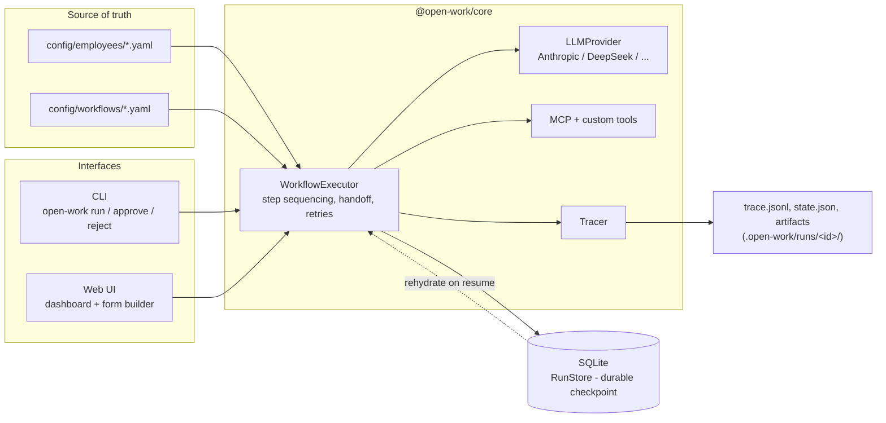

# Open Work

[](https://github.com/misdarmanto/openwork/actions/workflows/ci.yml)
[](./LICENSE)

**Build and run teams of AI agents. Open source, self-hosted, define once in
YAML, run forever.**

Open Work is a platform for defining "employees" (AI agents with a role,
model, tools, and constraints) and wiring them into a fixed, human-defined
workflow - `researcher → scriptwriter → reviewer → approval` - that runs
durably and resumably, with every LLM call and every dollar spent logged.
Employees and workflows are YAML files, not database rows: git-committable,
reviewable in a pull request, reproducible.

It is not a general chatbot framework and not a drag-and-drop automation
builder. See [`docs/DESIGN.md`](./docs/DESIGN.md) for why it's built the way
it is - in particular, why a human fixes the workflow chain instead of
letting agents negotiate it (reliability compounds badly otherwise), and why
there's no LangChain/LangGraph dependency.

## See it work

This is an **excerpt**, trimmed for length, of a real terminal session run
against a live DeepSeek API key - full unedited transcript, including every
`[ERROR]` line, in
[`docs/demo-transcript.txt`](./docs/demo-transcript.txt):

```
$ open-work validate research-and-script-deepseek
✓ workflow "research-and-script-deepseek" is valid (3 steps)

$ open-work run research-and-script-deepseek -p topic="the AGPL license"
{"event":"step_started","runId":"a3016181-a794-4f60-b2dc-1e87fb632ac6","step":"research","employee":"content-researcher-deepseek"}
{"event":"tool_call","runId":"a3016181-a794-4f60-b2dc-1e87fb632ac6","step":"research","tool":"duckduckgo_web_search","input":{"query":"AGPL license usage trends 2024 open source","count":10}}
[ERROR] Search failed - Query: "AGPL license usage trends 2024 open source" Error: DDG detected an anomaly in the request, you are likely making requests too quickly.
  ... (10 more tool_call/[ERROR] pairs - every search attempt failed the same way, and the agent kept retrying instead of giving up; full output in docs/demo-transcript.txt)

Error: Employee "content-researcher-deepseek" exceeded max_turns (10)
    at WorkflowExecutor.runAgentLoop (...)

$ sqlite3 .open-work/db.sqlite "SELECT id, status, error_message FROM runs WHERE id='a3016181-a794-4f60-b2dc-1e87fb632ac6';"
a3016181-a794-4f60-b2dc-1e87fb632ac6|failed|Employee "content-researcher-deepseek" exceeded max_turns (10)
```

Every one of the 11 search attempts in that run genuinely failed - DuckDuckGo
anomaly-blocks this sandbox's IP (see `ROADMAP.md`'s Phase 2 note) - and the
agent kept retrying instead of giving up, burning its whole `max_turns`
budget and failing the run. This is not a cherry-picked success: it's what
this project's free, no-API-key search integration actually does today in
an environment DuckDuckGo has flagged, and it's left in deliberately rather
than swapped for a cleaner run. What the transcript does demonstrate is the
process crashing with an uncaught exception does not lose or corrupt state:
the run's status in the durable SQLite store, queried directly above, is
correctly `failed` with the real error message attached, not left `running`
forever or silently dropped. The reject -> resubmit -> approve cycle is
exercised for real by `packages/core/src/executor/index.test.ts`, not shown
here since this run never reaches that step.

There's also a minimal web UI (`packages/web`) covering the same flow -
dashboard, run detail with approve/reject, and a form builder that generates
the same YAML a developer would hand-write. See
[`packages/web/README.md`](./packages/web/README.md).

## How it fits together



Every arrow into `WorkflowExecutor` is the same code path regardless of
whether it was triggered from the CLI or the web UI - see `CLAUDE.md`'s
dual-interface decision. `RunStore` (SQLite) is the durable checkpoint that
`resume`/`approve`/`reject` rebuild state from; the `.open-work/runs/`
files are for humans and `git diff`, not for the executor's own logic.

## Quick start

Requires Node 22+ (see `.nvmrc`; run `nvm use` if you use nvm).

```bash
pnpm install
cp .env.example credentials.env   # fill in at least one provider API key
export $(cat credentials.env | xargs)

pnpm build

# open-work resolves config/ relative to the current working directory,
# so run these from the repo root (this is where your own config/ would
# live if you fork this repo as your own workflow project):
npx tsx packages/cli/src/index.ts validate research-and-script
npx tsx packages/cli/src/index.ts run research-and-script -p topic="AI agents in 2026"
```

Or the web UI: `pnpm --filter @open-work/web dev`, then open
http://localhost:3000 - see [`packages/web/README.md`](./packages/web/README.md).

## Why it's built this way, vs the alternatives

| | Open Work | n8n / Make / Zapier | CrewAI / AutoGen / LangGraph | ChatDev / MetaGPT |
|---|---|---|---|---|
| Unit of work | Agents that can decide strategy within a step | Deterministic sequential nodes | Agents, embedded in your app | Fixed software-dev roles |
| Source of truth | Git-committed YAML | Visual builder + DB | Python/JS code | Hard-coded roles |
| Durability | Built-in - SQLite checkpoint, resumable | Built-in | Ephemeral, in-process | Ephemeral |
| Distribution | Standalone platform (CLI + web) | Standalone platform | Library you embed | Standalone, narrow use case |
| Handoff between steps | Structured brief (objective/context/constraints) | N/A (sequential) | Free-form agent chat | Free-form agent chat |

Full reasoning, including the reliability-math argument for why the workflow
chain is fixed by a human rather than negotiated by agents, in
[`docs/DESIGN.md`](./docs/DESIGN.md).

## Project status

Pre-1.0. See [`ROADMAP.md`](./ROADMAP.md) for what's actually done and
verified vs. still open - it's kept honest, including the things that don't
work yet (Google Drive / Gmail integrations are deliberately deferred,
noted with why).

## Structure

```
packages/
  core/    execution engine, schema, providers, store, MCP/custom tools (no UI)
  cli/     `open-work` command (run/resume/approve/reject/validate/approvals)
  web/     Next.js dashboard, approval queue, form-based workflow builder
config/
  employees/*.yaml   agent definitions - commit these
  workflows/*.yaml   workflow chains - commit these
docs/
  DESIGN.md            the reasoning behind the three biggest architecture decisions
  demo-transcript.txt  full, unedited terminal session referenced above
```

## Contributing

See [`CONTRIBUTING.md`](./CONTRIBUTING.md). First-time contributors are
expected to sign a CLA (see [`CLA.md`](./CLA.md)); automated signing (e.g.
CLA Assistant) isn't wired up yet, so for now that happens manually - see
`CONTRIBUTING.md` for how.

## Security

See [`SECURITY.md`](./SECURITY.md) for how to report a vulnerability.

## License

[AGPL-3.0-only](./LICENSE).
